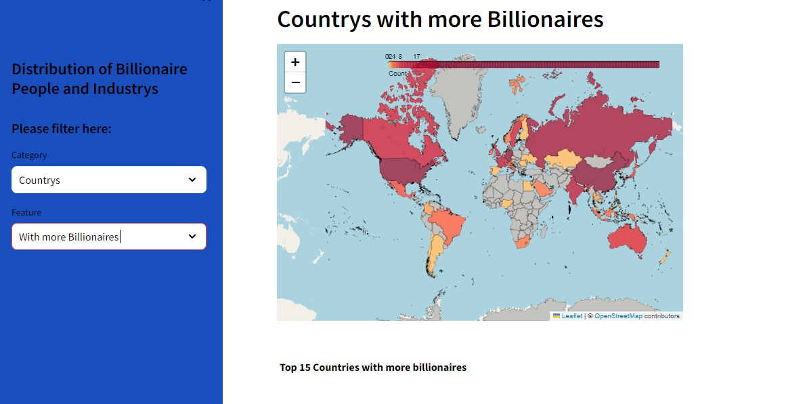
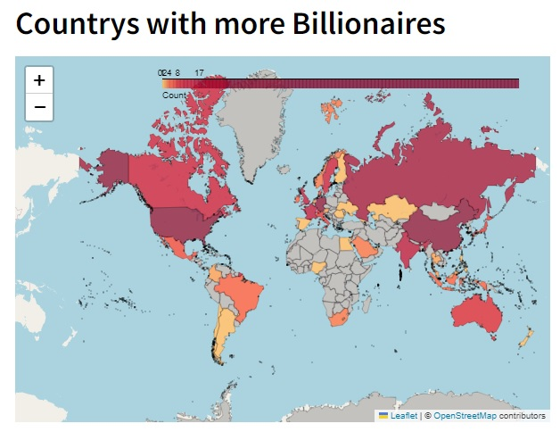
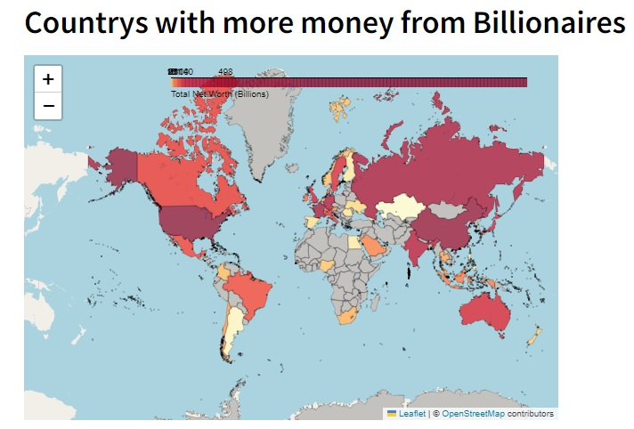
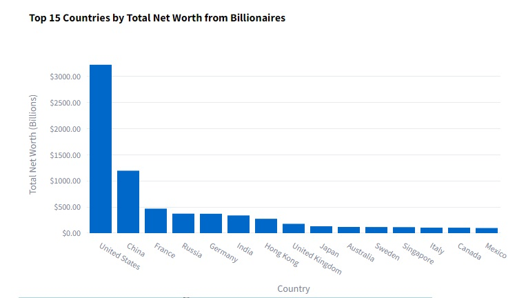
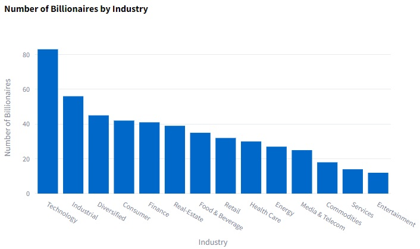
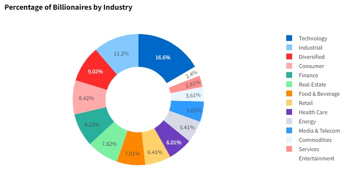

### **Distribution of Billionaire People and Industrys**
####  By Angela Escobar

# Table of Contents
1. [Access to the Streamlit app](#access-to-the-streamlit-app)
2. [Project description and objective](#project-description-and-objective)
3. [Data preparation and processing](#data-preparation-and-processing)
4. [Analysis and development of the Streamlit app](#analysis-and-development-of-the-streamlit-app)
5. [Conclusions](#conclusions)
6. [Tech Stack](#tech-stack)

## Access to the streamlit app: 
You can access to the interactive dashboard at the following link: 

## Project description and objective

This project analyzed a database containing information about the 500 wealthiest people in the world, including their wealth, location, and industry. The purpose was to identify patterns and trends in global wealth distribution, as well as to better understand the dynamics of the global economy and the impact of individual fortunes on different sectors and industries.

The project aimed to answer the following specific questions:

Which countries and industries have the highest number of billionaires and capital movement?

## Data preparation and processing

In the preparation of this analysis project, the necessary metrics were determined to conduct the study. The database was located, downloaded, and subsequently securely and systematically organized on the computer. Additionally, se creo el repositorio para tener control de versiones disponible to ensure the security of the information.

For data processing, a thorough cleaning procedure was conducted, focusing on identifying erroneous or inaccurately entered data and removing any duplicated information. Additionally, outliers were identified and handled appropriately to ensure the integrity and accuracy of the dataset. Data normalization and transformation techniques were applied as needed to prepare the data for analysis. 

This is a list of the specific actions that were carried out. More detailed information can be found in the project code.

* Import datasets specifying separator
* Remove rows with missing values 
* Clean column names
* Remove empty spaces
* Review and correct the data type of each column
* Hide columns that would not be relevant for the analysis.
* Filter some columns to omit zero values
* Rename columns

## Analysis and development of the Streamlit app

An interactive dashboard was developed to facilitate the user's handling and understanding of the information. The user interface appeared as follows:

The specific aspects targeted for analysis were initially outlined, involving an intricate breakdown of the key focal areas slated for examination. The detailed execution of the analysis are further elaborated within the project's codebase. These are the results obtained after the process of analysis.

## Conclusions

* The United States is the country with the highest number of billionaires, totaling 157, more than double that of China, which is the next country with 77 billionaires, followed by Germany and Russia.

* Despite France being in 7th place in the ranking by number of billionaires, in the ranking by total net worth of billionaires, it is in 3rd place, after China and the US respectively. This indicates that in France, although there are fewer people, their fortune is greater than that of billionaires from countries such as Germany, Russia, Hong Kong, India, and the United Kingdom.

* If all billionaires from Germany, Russia, Hong Kong, India, the United Kingdom, France, Canada, and Sweden were to combine their fortunes, it would still be less than that of billionaires from the United States.

* The most profitable industry is the technology sector, accounting for 15% of this ranking, followed by the industrial sector and diversified investments.

* The technology industry in 2021 is the main source of income for a significant percentage of billionaires across the world, accumulating a total net worth of over 2000 billion dollars.

## Tech Stack

  Python

  Streamlit

  Visual Studio

_______________END OF CASE STUDY______________________
